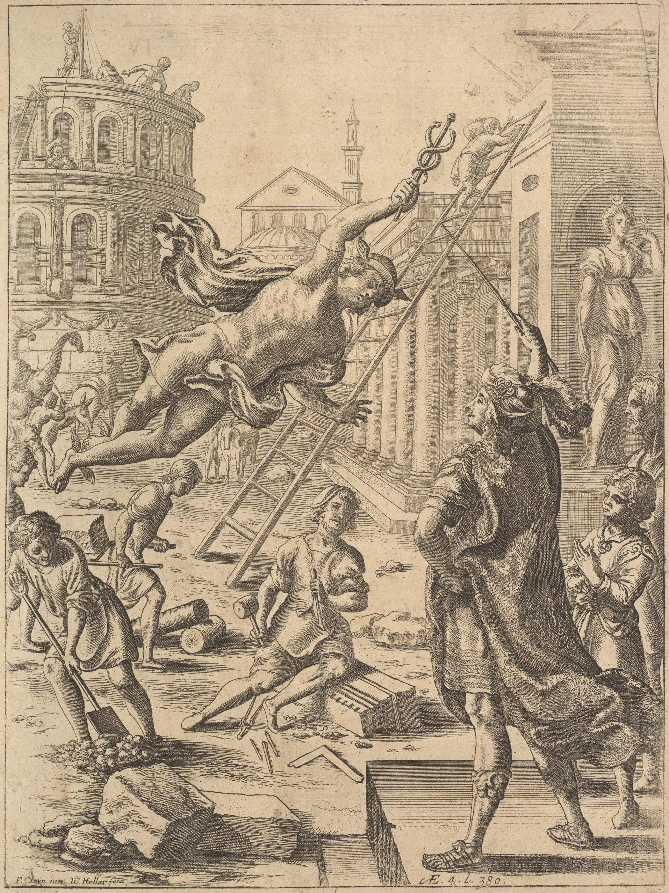

# `raise`

Infrastructure provisioning CLI with raise-* plugins.

## Usage

```bash
# Provision infrastructure
raise up myvm --from libvirt -f infrastructure.yaml

# Stop infrastructure
raise halt myvm --from libvirt

# Destroy infrastructure
raise destroy myvm --from libvirt

# SSH into infrastructure
raise ssh myvm --from libvirt

# Show status (all providers)
raise status

# Show status (specific provider)
raise status --from libvirt

# List discovered plugins
raise plugins
```

## Plugin Discovery

Raise discovers plugins by scanning PATH for binaries matching `raise-*`. Each plugin is a standalone CLI that implements the raise plugin protocol.

## Available Plugins

- `raise-libvirt` - Libvirt/KVM provider
- `raise-virtualbox` - VirtualBox provider
- `raise-vmware` - VMware provider
- `raise-aws` - AWS EC2 provider
- `raise-hetzner` - Hetzner Cloud provider
- `raise-digitalocean` - DigitalOcean provider
- `raise-opentofu` - OpenTofu provider

## Copyright
- "<a rel="noopener noreferrer" href="https://www.metmuseum.org/art/collection/search/380572">Aeneas and Mercury (from &#039;The Works of Virgil: Containing his Pastorals, Georgics and Aeneis,&#039; 1697)</a>" by Wenceslaus Hollar is marked with <a rel="noopener noreferrer" href="https://creativecommons.org/publicdomain/zero/1.0/?ref=openverse">CC0 1.0 </a>.

## License

The license for the code and documentation can be found in the [LICENSE](./LICENSE) file.

---

Made in Québec 🏴󠁣󠁡󠁱󠁣󠁿, C 🇨🇦!
